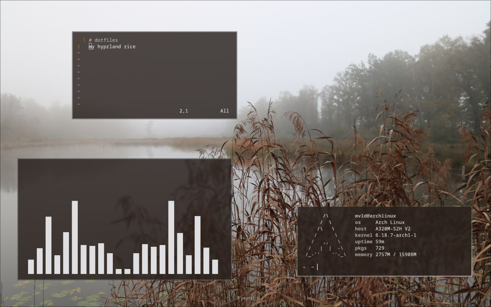

# dotfiles
my hyprland rice



to install you need:
installed `git`, `stow`, `hyprland`, `hyprlock`, `hyprshot`, `kitty` and `rofi` on your system
and enter following commands in your shell:
```
git clone https://github.com/moveleed/dotfiles ~/.dotfiles
cd ~/.dotfiles
stow .
```
if you have any errors check that you dont have `~/.zshrc`, `~/.vimrc` files and `~/.config/{hypr,rofi,kitty}` folders. save and delete it for now.
